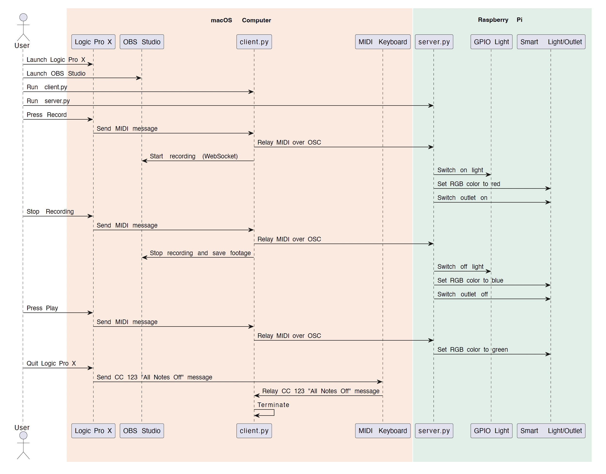
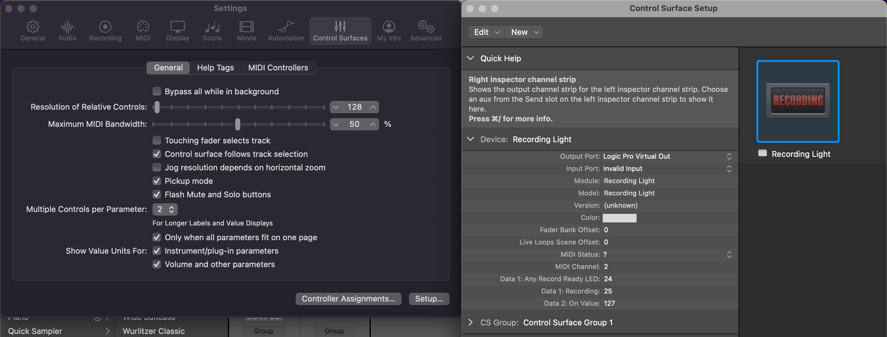
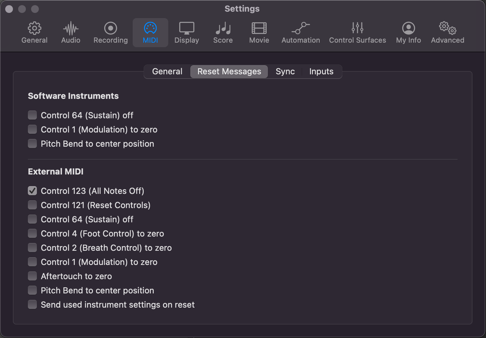

# Recording Light for Logic Pro X

This repo contains the code I'm running in order to automate a few things when recording with Logic Pro X (LPX). Eg:
- Hitting record in Logic Pro X will turn on a light connected to a Raspberry Pi, start video recording in OBS, and turn my Tradfri lights red.
- Hitting play/pause will change the color of my Tradfri bulb

What you'll need:
- Raspberry Pi with internet access (I'm using a RPi3 rev B)
- Some kind of LED light / strip for the light
- A relay / optocoupler
- A breadboard
- Some jumper wires
- OBS Studio
- A MIDI keyboard
- Optionally, I'm using a Tradfri RGB light bulb, and a Tradfri outlet.

## Sequence Diagram

To help with the mental model of the various components, here's an overview of the current system as a sequence diagram




## Some notes on the setup
- `client.py` runs on the macbook running Logic Pro X. As of now, it also controls video recording in OBS Studio.
- `server.py` runs on the Raspberry Pi. It listens for MIDI messages from `client.py` and controls the light connected to the RPi's GPIO, as well as any smart lights/outlets.
- Quitting LPX will make `client.py` exit. This is by design, since callbacks in `client.py` are tied to MIDI inputs that are available through LPX. When you quit LPX, those MIDI inputs are no longer available, which breaks the callback loop in `client.py`.

## Logic Pro X MIDI settings
In LPX, 2 things need to be set up:

- Set up a [recording light](https://support.apple.com/guide/logicpro-css/recording-light-setup-ctls73d03c8e/mac) by going to: `Logic Pro X` > `Settings` > `Control Surfaces` > `Setup` > `New` > `Recording Light`


- Set up LPX to send `All Notes Off` messages (CC 123) upon quitting. This message is sent to the external MIDI keyboard, which is then picked up by `client.py` to exit gracefully. To do this, go to: `Preferences` > `MIDI` > `Reset Messages` > Check `All Notes Off` in the External Instrument section.


## OBS Studio settings
In order to control OBS, we'll make use of its Websocket API. Make sure to have OBS installed, then set it up as follows: enable  the Websocket Server by going to `OBS` > `Tools` > `Websocket Server Settings` > `Enable Websocket Server`

## Env Setup (for both rpi and mac)
```bash
conda create --name logic_recording_light python=3.11
conda activate logic_recording_light
pip install -r requirements.txt
```

On the RPi:
```bash
pip install RPi.GPIO
```

Note: if you don't want to use conda on the rpi and want to use venv instead:
```bash
mkdir ~/venvs
python3 -m venv ~/venvs/logic_recording_light_venv
source ~/venvs/logic_recording_light_venv/bin/activate
pip install -r requirements.txt
```

## Usage

First, run the env set up commands above on both the Raspberry Pi and the mac running Logic Pro X.

### On the Raspberry Pi:
```bash
# Inside the venv
python server.py
```
You should see something like
```
± python server.py
2025-01-23 14:44:20.648 | INFO     | LightController:__init__:14 - Set pin #16 to OUT in [GPIO.BOARD] mode
2025-01-23 14:44:20.653 | INFO     | __main__:<module>:78 - Listening on ('0.0.0.0', 5005)
2025-01-23 14:44:21.654 | INFO     | LightController:health_check:27 - Ready
```

### On the mac running Logic Pro X:
- Open 'Logic Pro X' and create a new project.
- Open and set up [OBS Studio](https://obsproject.com/download). I have it set up to capture HDMI input from a camera.

Then, run the following command:
```bash
python client.py --record_obs
```
You should see something like:
```bash
± python client.py --record_obs
2025-02-27 13:26:03.183 | INFO     | __main__:<module>:102 - OBS recording control enabled
2025-02-27 13:26:03.195 | INFO     | OBSController:__init__:36 - OBS Version: 31.0.1
2025-02-27 13:26:03.195 | INFO     | __main__:create_osc_client:62 - Connecting to rpi.local:5005
2025-02-27 13:26:03.476 | INFO     | __main__:create_osc_client:65 - Resolved hostname rpi.local to IP address 192.168.40.28
2025-02-27 13:26:03.478 | INFO     | __main__:<module>:123 - (0).       Logic Pro Virtual Out
2025-02-27 13:26:03.478 | INFO     | __main__:<module>:127 - Opened MIDI port Logic Pro Virtual Out
2025-02-27 13:26:03.479 | INFO     | __main__:<module>:133 - OSC client set up with hostname rpi.local on port 5005
2025-02-27 13:26:03.479 | INFO     | __main__:<module>:134 - Sending MIDI messages over OSC channel /midi
```

You can (should!) change the hostname of your rpi with the flag `--rpi_hostname`:
```bash
python client.py --rpi_hostname rpi.local
```
If you're testing both server and client locally on your mac, you can set `--rpi_hostname localhost`.

Pressing `record` in Logic Pro X should then:
- Turn on the light connected to the RPi
- Start recording in OBS (if `--record_obs` is enabled). Make sure to have OBS running.

The logs from `client.py` will indicate where the video recording is saved.

### Testing the setup
In Logic Pro X, start recording by pressing the red button at the top. Your light should turn on.


## Running locally
If you want to run the server and client on the same machine (e.g. for testing), you can run the client to point to localhost:
```bash
# Terminal 1
python client.py --rpi_hostname localhost

# Terminal 2
python server.py
```
In this setup, a Dummy light will be used instead of the recording light controlled by rpi's GPIO.

## Optional: Dirigera + Tradfri lights
This section assumes you have a Dirigera hub and a Tradfri accessory (light bulb, outlet, etc) set up.
You will need to export the following environment variables, which you can obtain by following the setup described in the repo for the [Dirigera module](https://github.com/Leggin/dirigera):
```bash
export DIRIGERA_TOKEN=<your_token>
export DIRIGERA_IP_ADDRESS=<dirigera_ip_address>
```

## Troubleshooting
When running `client.py` on the mac, if you see something like:
```bash
± python client.py
2025-01-19 17:14:19.139 | WARNING  | __main__:<module>:47 - No MIDI ports available. Make sure
that Logic Pro X is open, and that a recording light was setup:
Logic Pro X -> Settings -> Control Surfaces -> Setup -> New
-> Recording Light
2025-01-19 17:14:19.139 | INFO     | __main__:<module>:48 - Exiting...
```
Make sure that Logic Pro X is open, and that a recording light was setup. Specifically, this code is looking for a Virtual MIDI port called `Logic Pro Virtual Out`.


When running `server.py` on the RPi, if you see something like:
```bash
  File "/usr/lib/python3.11/socketserver.py", line 456, in __init__
    self.server_bind()
  File "/usr/lib/python3.11/socketserver.py", line 472, in server_bind
    self.socket.bind(self.server_address)
OSError: [Errno 98] Address already in use
```
This means that you may already have an instance of `server.py` running on the same port (5005 by default).
To kill that process, we need to find the PID of the process:
```bash
lsof -i :5005
```
You'll see something along the lines of:
```bash
COMMAND  PID  USER   FD   TYPE DEVICE SIZE/OFF NODE NAME
python  1651 thien    4u  IPv4  10673      0t0  UDP *:5005
```

Take note of the PID (1651 in this case) and kill the process with:
```bash
kill 1651
```
Now you should be able to run `python server.py` again.

